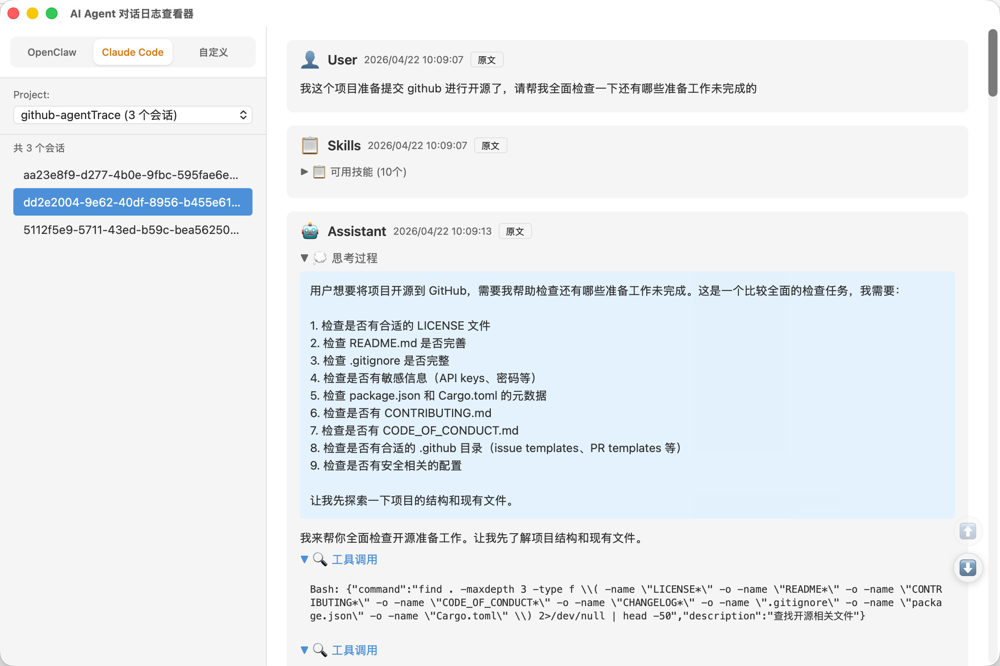

# AI Agent 对话日志查看器

一个基于 Tauri + React + TypeScript 构建的桌面应用，用于可视化查看 AI Agent 的 JSONL 格式对话日志。



## 功能特性

- 📂 **多来源支持** - 支持 OpenClaw、Claude Code、自定义路径三种日志来源
- 💬 **对话可视化** - 用户消息、助手回复、系统消息、工具调用一目了然
- 🛠️ **工具调用展示** - 自动关联工具调用与执行结果，支持折叠展开
- 💭 **思考过程** - AI 思考内容单独折叠显示
- 📝 **Markdown 渲染** - 支持 Markdown 格式文本，包括代码块、列表、表格等
- 📄 **原文查看** - 每条消息可切换查看原始 JSON 数据
- 🎨 **JSON 格式化** - 自动识别并格式化 JSON 内容
- ⏱️ **时间戳转换** - 自动转换为本地时间显示
- 📏 **可调整布局** - 侧边栏宽度可自由拖动调整

## 技术栈

| 层级 | 技术 |
|------|------|
| 前端 | React 19 + TypeScript |
| 框架 | Tauri 2.0 |
| 构建 | Vite |
| 后端 | Rust |

## 安装

### 前置要求

- [Node.js](https://nodejs.org/) 18+
- [Rust](https://rustup.rs/)
- macOS / Windows / Linux

### 开发模式

```bash
# 克隆项目
git clone https://github.com/before31/AgentTrace.git
cd AgentTrace

# 安装依赖
npm install

# 启动开发服务器
npm run tauri dev
```

### 代码规范

```bash
# 前端 lint
npm run lint

# 前端格式化
npm run format

# Rust 格式化
cd src-tauri && cargo fmt

# Rust lint
cd src-tauri && cargo clippy
```

### 构建发布

```bash
# 构建生产版本
npm run tauri build
```

构建产物位于 `src-tauri/target/release/bundle/` 目录。

## 使用方法

1. **选择日志来源** - 在左侧选择 OpenClaw、Claude Code 或自定义路径
   - OpenClaw: 自动扫描 `~/.openclaw/agents/[agentId]/sessions` 目录
   - Claude Code: 自动扫描 `~/.claude/projects/[project-name]/sessions` 目录
   - 自定义: 输入任意路径后点击扫描
2. **选择文件** - 从文件列表中选择要查看的 JSONL 文件
3. **浏览对话** - 查看完整的对话流程，包括用户输入、AI 回复、工具调用等
4. **查看原文** - 点击「原文」按钮可查看每条消息的原始 JSON 数据

## 支持的日志格式

应用内置多个解析器，自动识别不同来源的日志格式：

- **OpenClaw** 
- **Claude Code** 
- **自定义** - 自动判断文件格式，选择合适的解析器

支持的消息类型：
- 用户消息、助手消息、系统消息
- 工具调用与工具结果
- 思考内容（thinking）

### 示例 JSONL 格式

```json
{"type":"message","message":{"role":"user","content":[{"type":"text","text":"你好"}]}}
{"type":"message","message":{"role":"assistant","content":[{"type":"text","text":"你好！"},{"type":"thinking","thinking":"用户打招呼"}]}}
{"type":"message","message":{"role":"assistant","content":[{"type":"tool_use","id":"call-1","name":"search","input":{"query":"天气"}}]}}
{"type":"message","message":{"role":"tool","content":[{"type":"tool_result","tool_use_id":"call-1","content":"晴天，25°C"}]}}
```

## 项目结构

```
AgentTrace/
├── src-tauri/                # Rust 后端
│   ├── src/
│   │   ├── lib.rs            # Tauri 命令注册
│   │   └── commands/
│   │       └── file_ops.rs   # 文件扫描、读取
│   └── tauri.conf.json       # 应用配置
│
├── src/                      # React 前端
│   ├── components/
│   │   ├── AppShell/         # 整体布局
│   │   ├── Sidebar/          # 文件列表侧边栏
│   │   ├── ResizableDivider/ # 可拖动分隔条
│   │   ├── ChatMessage/      # 单条消息组件
│   │   ├── ToolExpander/     # 工具调用折叠框
│   │   ├── ThinkingBlock/    # 思考过程折叠
│   │   ├── MarkdownContent/  # Markdown 渲染
│   │   ├── JsonRaw/          # 原文 JSON 展示
│   │   ├── LoadingSpinner/   # 加载动画
│   │   ├── ScrollNav/        # 滚动导航按钮
│   │   └── Toast/            # 提示消息
│   ├── hooks/
│   │   ├── useSourceSelector.ts # 来源选择与文件列表管理
│   │   └── useJsonlParser.ts # JSONL 解析逻辑
│   ├── parsers/
│   │   ├── index.ts          # 解析器入口
│   │   ├── OpenClawParser.ts # OpenClaw 日志解析
│   │   ├── ClaudeCodeParser.ts # Claude Code 日志解析
│   │   └── types.ts          # 解析器类型定义
│   ├── types/
│   │   └── message.ts        # TypeScript 类型定义
│   └── utils/
│       ├── format.ts         # 时间戳、JSON 格式化
│       └── cn.ts             # 类名拼接工具
│
└── package.json
```

## 技术选型

最初我用 [Streamlit](./streamlit/) 实现了一版，基本功能已经具备，但是考虑到 python 程序分发困难，索性重新开发了 Tauri 版本：

| 特性 | Streamlit 版 | Tauri 版 |
|------|-------------|---------|
| 分发方式 | 需 Python 环境 | 单文件安装包，开箱即用 |
| 大文件支持 | 全量加载 | 可扩展流式读取 |
| 文件监听 | 手动刷新 | 可扩展自动监听 |
| 性能 | Python 解释执行 | 原生性能 |

原 Streamlit 实现保留在 `streamlit/` 目录作为参考。

## 开发计划

- [ ] 设置功能（支持自定义忽略文件列表）
- [ ] 全文搜索与过滤
- [ ] subagent 支持

## License

MIT
